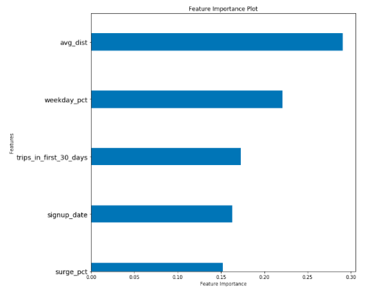

## Case Study

The problem is churn prediction with a ride-sharing company in San Francisco.

Since the data is sourced from a real company, I am not able to share the dataset. 

## Case Study - Churn Prediction

A ride-sharing company (Company X) is interested in predicting rider retention.
To help explore this question, there is a sample dataset of a cohort of
users who signed up for an account in January 2014. The data was pulled on July
1, 2014; we consider a user retained if they were “active” (i.e. took a trip)
in the preceding 30 days (from the day the data was pulled). In other words, a
user is "active" if they have taken a trip since June 1, 2014. 

The data is used to help understand **what factors are
the best predictors for retention**, and offer suggestions to help Company X. 
We built a
model that minimizes error, but also a model that allows interpretability of the
factors that contributed to the predictions.

Here is a detailed description of the data:

- `city`: city this user signed up in phone: primary device for this user
- `signup_date`: date of account registration; in the form `YYYYMMDD`
- `last_trip_date`: the last time this user completed a trip; in the form `YYYYMMDD`
- `avg_dist`: the average distance (in miles) per trip taken in the first 30 days after signup
- `avg_rating_by_driver`: the rider’s average rating over all of their trips 
- `avg_rating_of_driver`: the rider’s average rating of their drivers over all of their trips 
- `surge_pct`: the percent of trips taken with surge multiplier > 1 
- `avg_surge`: The average surge multiplier over all of this user’s trips 
- `trips_in_first_30_days`: the number of trips this user took in the first 30 days after signing up 
- `luxury_car_user`: TRUE if the user took a luxury car in their first 30 days; FALSE otherwise 
- `weekday_pct`: the percent of the user’s trips occurring during a weekday

## Work Flow

1. Perform any cleaning, exploratory analysis, and/or visualizations to use the
provided data for this analysis.
   

 

2. Build a predictive model to help determine the probability that a rider will
be retained.

3. Evaluate the model.  Focus on metrics that are important for your *statistical
model*.
 
4. Identify / interpret features that are the most influential in affecting
the predictions.

5. Discuss the validity of your model. Issues such as
leakage.  For more on leakage, see [this essay on
Kaggle](https://www.kaggle.com/wiki/Leakage), and this paper: [Leakage in Data
Mining: Formulation, Detection, and Avoidance](https://www.cs.umb.edu/~ding/history/470_670_fall_2011/papers/cs670_Tran_PreferredPaper_LeakingInDataMining.pdf).

6. Repeat 2 - 5 until we have a satisfactory model.

7. Consider business decisions that your model may indicate are appropriate.
Evaluate possible decisions with metrics that are appropriate for *decision
rules*.
   
## Details of case study
  - How did we compute the target?
    * To gather the target, we found all users who had not used our services in the past 30 days as a churned customer. 
  - What model did we use in the end?
    * We tested a number of different models including Random Forest, Gradient Boosting, and Adaboost. Ultimately, we chose an adaboost classifier and were able to predict churn outcomes accurately 78% of the time. 
    * The strongest features in our model include:
        - Users not giving a driver rating
        - Android users
        - Signup Date
        - Users in Astapor
        - Average rating given to drivers

 

  - **Based on insights from the model, what plans do you propose to
    reduce churn?**
    * Suggest that promotional offers be given to those who are predicted to churn

  - What are the potential impacts of implementing these plans or decisions?
    * According to cost benefit and profit curve analysis, implementing promotions to churning customers would yield $68000

 

  - Future Steps:
    * Feature refinement
    * Larger grid search
    * Further model optimization
    * Attempting more modeling techniques
    * Get better data to work with
